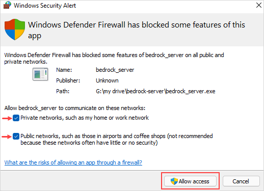
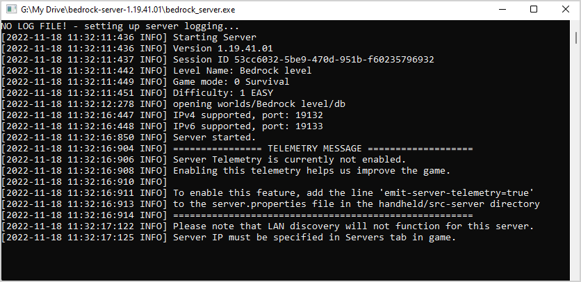

import Tabs from '@theme/Tabs';
import TabItem from '@theme/TabItem';

# How to make a private Minecraft server with Meshnet

## Introduction

Minecraft is one of the most popular multiplayer online games. To [enjoy the full gaming experience of Minecraft](https://nordvpn.com/gaming/minecraft/), you can create your own server and invite friends to join your world. However, running a public Minecraft server might present a security threat and open your home network to attacks.
With [Meshnet](https://nordvpn.com/features/meshnet/), you can set up your private Minecraft server and connect to it from anywhere in the world safely. Instead of having to open ports and expose your IP address to strangers online, you and your friends can connect your devices to Meshnet, which, in essence, acts as a local area network but with an encrypted VPN tunnel. Also, this approach implies that you will not pay for third-party hosting solutions.

Currently, there are two separate versions of Minecraft: Bedrock Edition and Java Edition. While both editions support online multiplayer mode, they are compatible with different servers. This means that you will use different server software depending on the game edition you are playing.
This guide walks you through the process of creating a Minecraft server with Meshnet for both editions on the following platforms:

| Minecraft Bedrock Edition     | Minecraft Java Edition  |
| ----------------------------- | ----------------------- |
| [Windows](#on-windows)                       | macOS                   |
| Linux                         |                         |

## Create a Minecraft Bedrock server on Windows and Linux

The official Minecraft Bedrock server software supports Windows and Linux.

### On Windows 

:::note

Other players on your Meshnet will be able to connect to your Bedrock server if these conditions are met:

* A player's game is Minecraft: Bedrock Edition.
* The game version matches the version of your server.

:::

#### Prerequisites

Before you begin, ensure that the machine that will host the server has the following prerequisites in place:
1. Windows 10 and later or Windows Server 2016 and later
2. 64-bit Intel or AMD processor with at least 2 cores
3. 1 GB of RAM or more
4. Meshnet is enabled on your server machine and all the client devices that will join your server. To learn how to enable Meshnet on Windows, see the [How to use Meshnet on Windows](https://support.nordvpn.com/General-info/Features/1872906652/How-to-use-Meshnet-on-Windows.htm) article.

#### Run your Bedrock server

1. Unzip the downloaded archive and double-click the **bedrock_server.exe** file.
2. If the **Windows Security Alert** box appears, select both the private and public networks options, and then click the **Allow access** button to allow incoming connections through the firewall. 

   

Also, you can check your firewall settings for the Bedrock server by selecting the **Start** menu and typing **Allow an app through Windows Firewall**.

3. Your Bedrock server should now be up and running. 

   

:::info

If you encounter connection issues, you may need to exempt the Minecraft client from UWP loopback restrictions. To do this, open Windows PowerShell or Command Prompt as an administrator, and enter the following:
```
CheckNetIsolation LoopbackExempt -a -n="Microsoft.MinecraftUWP_8wekyb3d8bbwe"
```
Alternatively, you can enter the command provided in the bedrock_server_how_to file:
```
CheckNetIsolation LoopbackExempt -a -p=S-1-15-2-1958404141-86561845-1752920682-3514627264-368642714-62675701-733520436
```

:::

#### Connect to your Bedrock server

1. Make sure that the device on which you play the game has the NordVPN app running and the Meshnet feature is enabled in the app.
2. Open your Minecraft game, select the **Play** button, and then select the **Servers** tab.
3. Scroll to the bottom of the **Featured Servers** list, and select the **Add Server** button.
4. In the **Server Name** box of the dialog that appears, enter a name for your server—you can choose any. 
5. In the **Server Address** box, enter the Meshnet IP address of the machine on which your server is running. Select **Save**. 

<Tabs>
  <TabItem value="windows" label="Windows" default>
    <h3> Prerequisites </h3> 
    Before you begin, ensure that the machine that will host the server has the following prerequisites in place:
    <ul>
        <li> Windows 10 and later or Windows Server 2016 and later</li>
        <li> 64-bit Intel or AMD processor with at least 2 cores</li>
        <li> 1 GB of RAM or more</li>
        <li> Meshnet is enabled on your server machine and all the client devices that will join your server. To learn how to enable Meshnet on Windows, see the How to use Meshnet on Windows article.</li>
    </ul>
  </TabItem>
  <TabItem value="linux" label="Linux">
    This is an orange 🍊
  </TabItem>
</Tabs>

