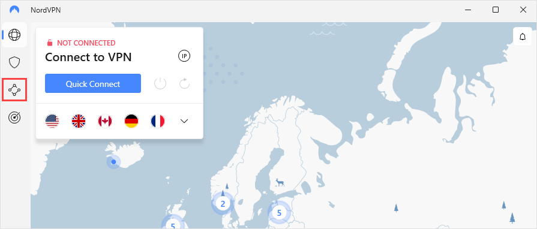
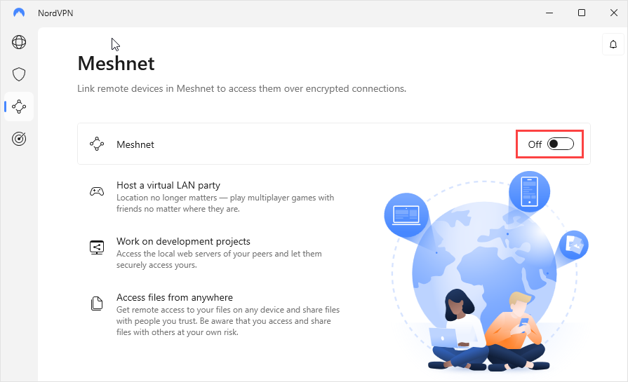
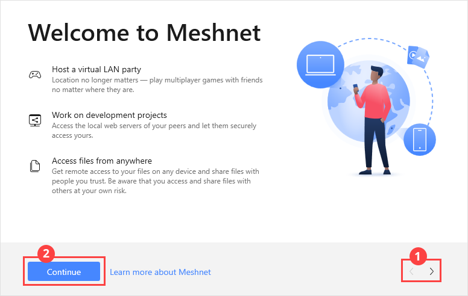

  

# Using Meshnet on Windows

## Supported Windows versions

Meshnet is available only on 64-bit editions of Windows 10 and later.

## Enable Meshnet on Windows

Complete the following steps to turn on Meshnet on your device:

1. Open the NordVPN app, and on the left-side menu, select the Meshnet icon .
   
    

2. Turn on the **Meshnet** toggle.

   

3. In the welcome dialog that appears, read the details about Meshnet, using the arrow buttons to navigate between pages. Select **Continue**. 

   

   Once the Meshnet feature is enabled, your device automatically gets a unique name and a Meshnet IP address.

## Add your devices to Meshnet

The Meshnet feature allows you to link up to 10 devices of your own.
To add your other device to Meshnet: 
1. Make sure the NordVPN app is installed on the device you want to connect to Meshnet and you are logged in to your NordVPN account.
2. In the NordVPN app on that device, turn on Meshnet.

